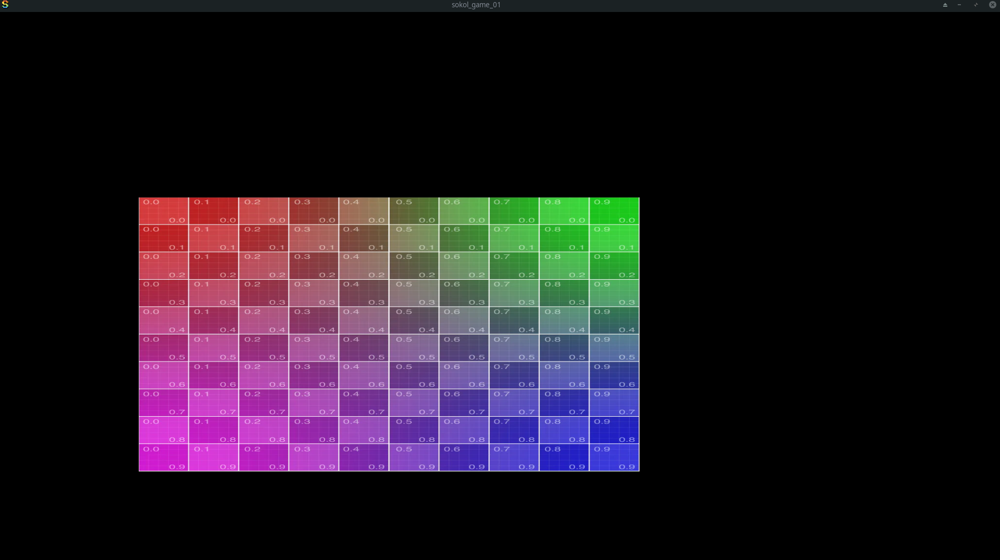

# Sokol C - Template

Bouncing textured quad.

```bash
git clone --recurse-submodules git@github.com:Avicted/sokol_game_01.git

chmod +x ./build.sh ./sokol-shdc

./build.sh
```

## Shader compiler
https://github.com/floooh/sokol-tools/blob/master/docs/sokol-shdc.md


## Screenshot
